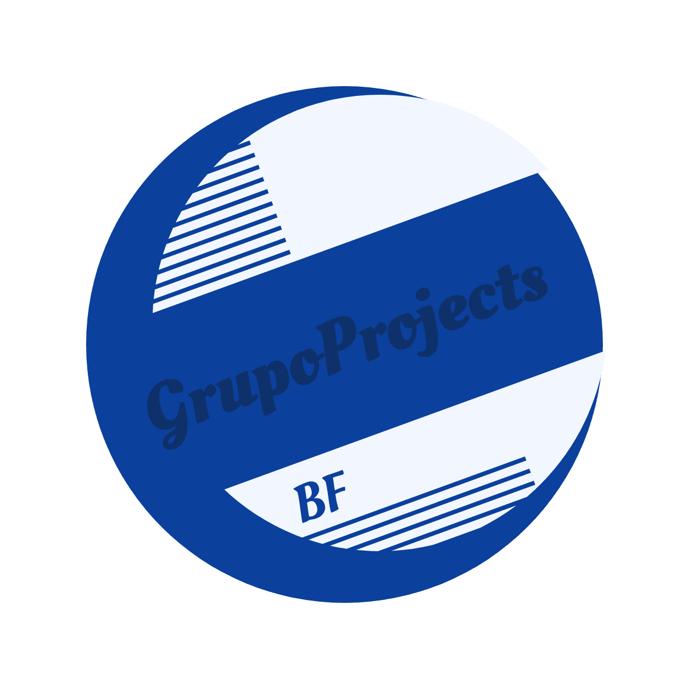

<!-- Improved compatibility of back to top link: See: https://github.com/othneildrew/Best-README-Template/pull/73 -->

<!--
*** Thanks for checking out the Best-README-Template. If you have a suggestion
*** that would make this better, please fork the repo and create a pull request
*** or simply open an issue with the tag "enhancement".
*** Don't forget to give the project a star!
*** Thanks again! Now go create something AMAZING! :D
-->

<!-- PROJECT SHIELDS -->
<!--
*** I'm using markdown "reference style" links for readability.
*** Reference links are enclosed in brackets [ ] instead of parentheses ( ).
*** See the bottom of this document for the declaration of the reference variables
*** for contributors-url, forks-url, etc. This is an optional, concise syntax you may use.
*** https://www.markdownguide.org/basic-syntax/#reference-style-links
-->

<!-- PROJECT LOGO -->
 

  

  <h3 align="center">Living Lab Maps API Demo in Flutterflow</h3>

  

    An awesome documentation on how to use <a href="https://app.flutterflow.io/project/grupo-projects-okp8wq">GrupoProjects</a>, the world's greatest marketplace!
     
    <a href="https://app.flutterflow.io/run/kdejBAZwCbukIfD9n7wb">View Demo</a>
    ·
    <a href="https://github.com/anorld-droid/grupoproject/issues">Report Bug</a>
    ·
    <a href="https://github.com/anorld-droid/grupoproject/issues">Request API Feature</a>
  

<!-- TABLE OF CONTENTS -->

  
Table of Contents

  <ol>
    <li>
      <a href="#set-up">Set up</a>
      <ul>
        <!-- <li></li> -->
      </ul>
    </li>
    <li>
      <a href="#architecture">Architecture</a>
      <ul>
        <!-- <li><a href="#prerequisites">Prerequisites</a></li> -->
        <!-- <li><a href="#installation">Installation</a></li> -->
      </ul>
    </li>
    <li><a href="#intergrations">Intergrations</a></li>
  </ol>

<!-- SET UP -->
## Set up

[![Product Name Screen Shot][product-screenshot]](https://app.flutterflow.io/run/kdejBAZwCbukIfD9n7wb)

Using the power of FlutterFlow, a visual programming platform for Flutter, and the versatility of Flutter/Dart, developers can leverage this implementation to effortlessly incorporate market place features into their applications. The project provides a comprehensive set of tools and functions to interact with firebase and algolia API, enabling developers to create intuitive and engaging user experiences.

To access this project and use it's features in your own projects go [here](https://app.flutterflow.io/run/kdejBAZwCbukIfD9n7wb)

The project leverages the visual programming capabilities of FlutterFlow and the flexibility of Flutter/Dart to create a seamless integration of the Firebase and algolia searxh API into FlutterFlow applications, enabling developers to design and implement search features with ease.

* [![Flutter][Flutter]][Flutter-url]
* [![FlutterFlow][FlutterFlow]][FlutterFlow-url]
* [![Dart][Dart]][Dart-url]

(<a href="#readme-top">back to top</a>)

## Architecture

The architecture comprises three main components: Firebase for backend services, Algolia Search API for search functionality, and FlutterFlow for frontend design and development. These components work together to create a seamless and feature-rich application.

Firebase provides a comprehensive suite of backend services that simplify the app development.

Algolia API provides powerful search and sort capabilities that enhance user experience and enable efficient data retrieval.

(<a href="#readme-top">back to top</a>)

<!-- ACKNOWLEDGMENTS -->
## Intergrations

<ol>
    <li>Users interact with the application through the FlutterFlow-designed UI.</li>
    <li>User authentication and data storage are managed by Firebase Authentication and Firebase Cloud Firestore.</li>
    <li>Data from Firebase is indexed and made searchable using Algolia Search API.</li>
    <li>Algolia's search results are efficiently displayed to users through the FlutterFlow interface.</li>
</ol>

(<a href="#readme-top">back to top</a>)

<!-- MARKDOWN LINKS & IMAGES -->
<!-- https://www.markdownguide.org/basic-syntax/#reference-style-links -->

[product-screenshot]: images/screenshot.png
[Flutter]: https://img.shields.io/badge/Flutter-blue?style=for-the-badge&logo=flutter&logoColor=white
[Flutter-url]: https://flutter.dev/
[FlutterFlow]: https://img.shields.io/badge/FlutterFlow-black?style=for-the-badge&logo=Flutterflo&logoColor=4839e3
[FlutterFlow-url]:https://flutterflow.io/
[Dart]: https://img.shields.io/badge/dart-black?style=for-the-badge&logo=dart&logoColor=blue
[Dart-url]: https://dart.dev/
